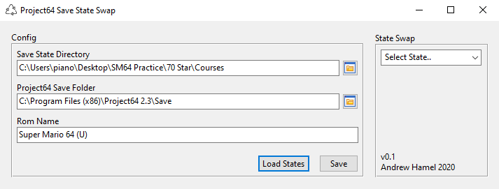
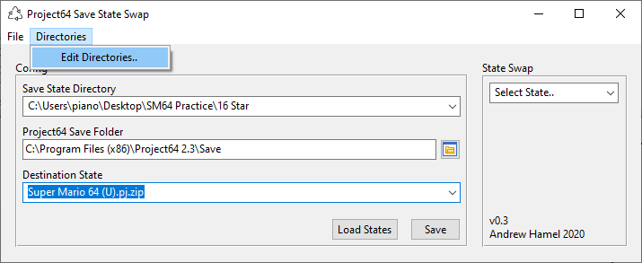
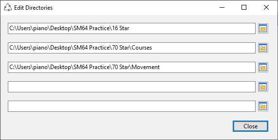
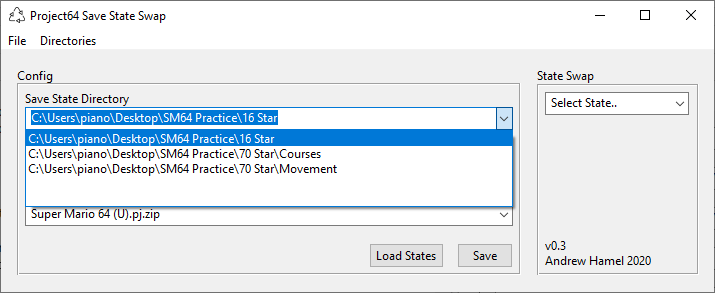
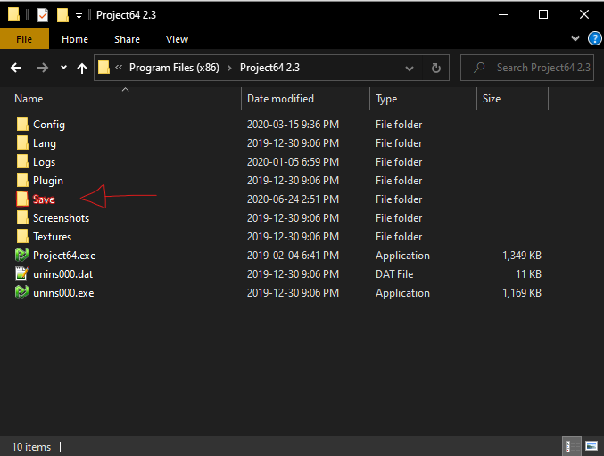
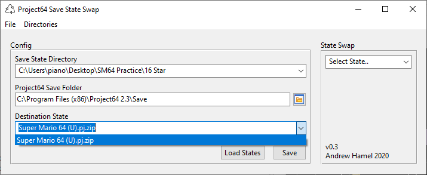

Project64 Save State Swap
=========================

About
-----
Project64 Save State Swap is a little form created using Lazarus v2.0.8 to allow for faster practice inside of Project64. I was learning Super Mario 64 at the time and quickly felt limited by the 10 save state slots + 1 additional 'default' slot - especially for the 70 star category - and decided to create a simple utility that replaces the default slot state. After navigating to both your practice states directory and your Project64 install directory, you can easily switch between your save states through a drop-down menu.

In it's current state, it's really only useful to those of you that already have a collection of practice save states and have struggled with manually copying and renaming the files every time you want to change course, however a new feature allowing the user to register a save state is under construction. You will be able to create a new save state in Project64, then use the form to add said save state to your practice folder under a custom name.

Screenshots
-----------

---

Configuration
-------------
Configuration can take a minute or two on your first startup only because you need to hunt down your directories, but don't worry! You won't have to do this every time. Once you've locked in your configuration, you can just hit Save and I will store the current configuration in an .ini in my directory. Also, if you understand the .ini format you can change the directories from there before starting the program again, although i'd recommend you stick to the directory edit inside of the form.

The first field should point to the directory with the save states you'd like to access. If you have multiple folders of save states and want to keep them separate for one purpose or another, this is where you choose the specific folder. You can save up to 5 directories to choose from in this combo box by selecting Directories > Edit Directories.. . A new form will open where you can add your directories, then hit close to return to the main form.

Here's where you can edit the directories.

Once that's done you can return to the main form and select the correct directory.

The second directory points to the Save folder in PJ64's installation directory, which by default should be in your C:\Program Files(x86). Of course, this is easily changed if you've installed it elsewhere.

The third field is a ComboBox populated by all the save states found inside your Save folder. Select the save state corresponding to your ROM and you're good to go.

Once you think you've got everything right hit **Load States** and take a peek inside the State Swap box. This form will consider ANY '.zip' to be a save state, so make sure you only have valid Project64 save states inside of the chosen directory. Now you can simply choose a state, tab back into Project64 and press your Load State key (default F7 on Windows) to load the selected state.

If your configuration works, hit **Save** and feel freed from the burden of configuration!

Please note that the .exe will automatically create the .ini storing your configuration settings in the same directory as the .exe.

Limitations (for the nerds)
---------------------------
PJ64SaveStateSwap has no protection against invalid save states or save states for the wrong game. This is very much an 'honor system' based approach but the good news is that it's _very_ unlikely it will damage your ROM or your installation of Project64.

Credits and License
-------------------

The Project64 Save State Swap icon is provided by http://icons8.com under the [Linkware](http://icons8.com/license/) license.

Lazarus v.2.0.8 can be found [here](https://www.lazarus-ide.org/index.php).

Shout out to [nduronio](http://www.twitch.tv/nduronio) for running SM64 70 Star and 16 Star with me.

_Shoutouts to Simpleflips_
